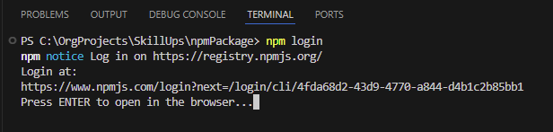
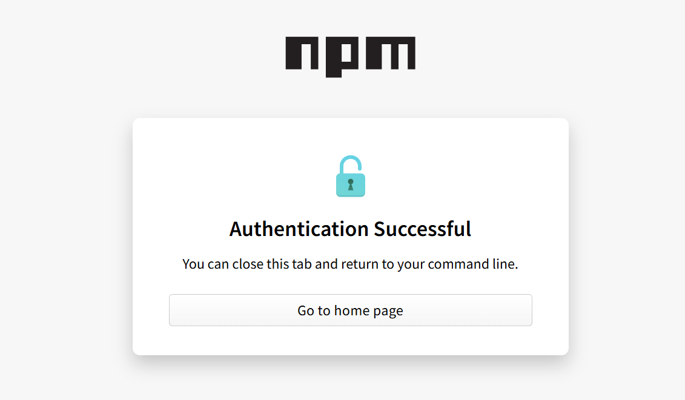
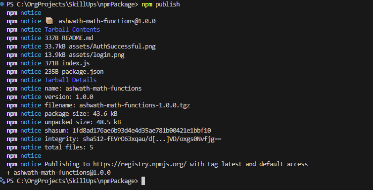
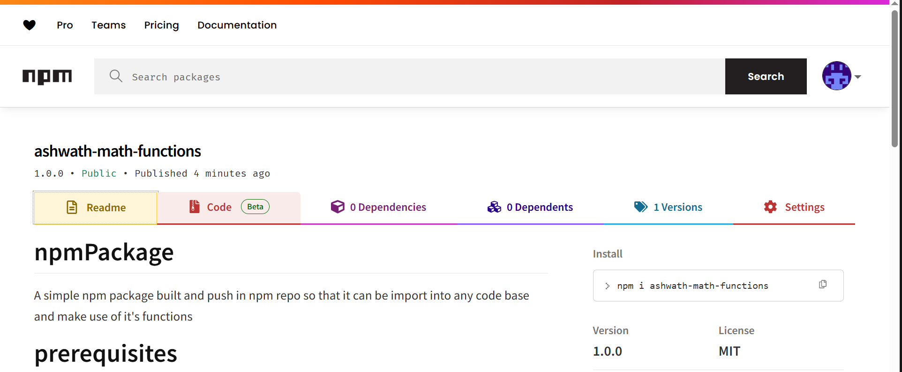

# npmPackage
A simple npm package built and push in npm repo so that it can be import into any code base and make use of it's functions

# prerequisites
    - Node.js and npm installed.
    - An npm account: https://www.npmjs.com/signup

# setting up
`npm init -y`

# publish to the npm repository





# NPM package in the site


# How to use it
Use `npm i ashwath-math-functions ` to install the package in to the working code and pfb the sample code to how to use the package.

```
const math = require('ashwath-math-functions');
const result = math.sum(24, 7);
console.log(result);

```
